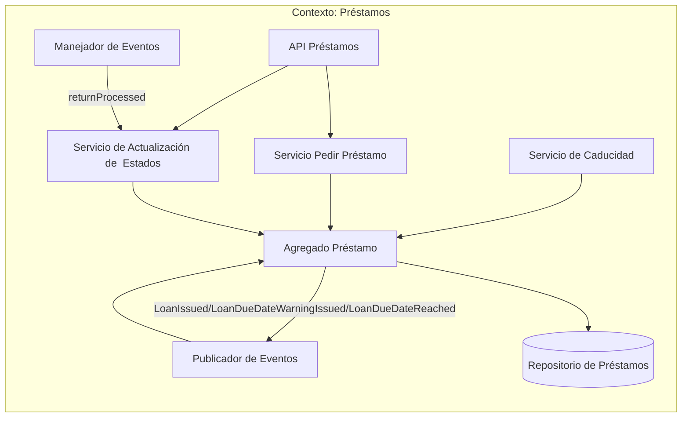
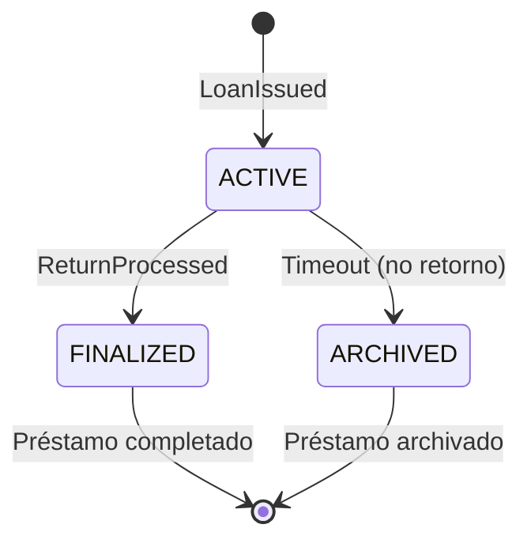
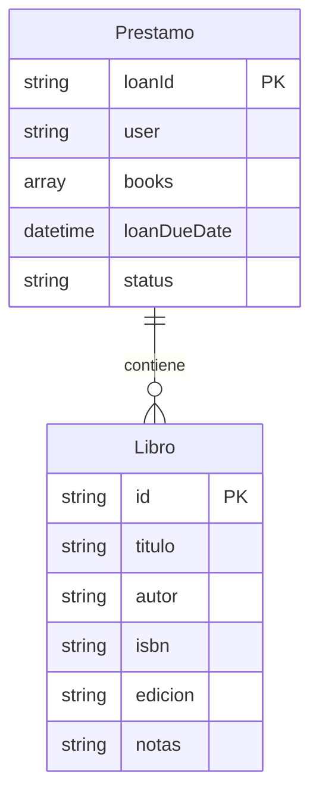
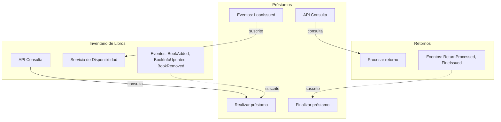

# Contexto delimitado: Préstamos

## Tabla de contenidos

- [Descripción](#descripción)
- [Lenguaje ubicuo](#lenguaje-ubicuo)
- [Modelo del dominio](#modelo-del-dominio)
  - [Objeto Préstamo](#objeto-préstamo)
  - [Estados del préstamo](#estados-del-préstamo)
- [Eventos](#eventos)
  - [Eventos emitidos](#eventos-emitidos-publicados-por-este-contexto)
  - [Eventos consumidos](#eventos-consumidos-de-otros-contextos)
- [Diagramas](#diagramas)
  - [Comunicación interna](#comunicación-interna)
  - [Estados de un préstamo](#estados-de-un-préstamo)
  - [Relación entre Préstamo y Libro](#relación-entre-préstamo-y-libro)
  - [Comunicación con otros contextos delimitados](#comunicación-con-otros-contextos-delimitados)
  - [Secuencia de eventos](#secuencia-de-eventos)
- [Resumen](#resumen)

## Descripción

El contexto de Préstamos se encarga de gestionar los préstamos que se realizan en la biblioteca. En este contexto, los libros son parte de un préstamo que tiene cierta fecha de caducidad y están asociados a un cliente. Este contexto también se encarga de generar eventos que tienen la intención de avisar al usuario si su préstamo está pronto a vencer. Para el scope de esta tarea, no se definen las reglas de tiempo de préstamo ni el monto de la multa. El manejo de usuarios y su posibilidad de préstamo pertenecen a otro contexto.

## Lenguaje ubicuo

| Término      | Significado en este contexto                           |
| ------------ | ------------------------------------------------------ |
| **Préstamo** | Préstamo de libros                                     |
| **Caducidad**| Fecha en la que el préstamo debe ser finalizado para no tener multas  |
| **Multa**    | Consecuencia de finalización tardía del préstamo. Monto monetario |
| **Estado**   | ACTIVE, ARCHIVED, FINALIZED                            |

## Modelo del dominio

### Objeto Préstamo

```
loan {
    loanId,
    user,
    books,
    status,
    loanDueDate
}
```

### Estados del préstamo


| Estado        | Descripción                                    |
| ------------- | ------------------------------------------------ |
| **ACTIVE**    | Préstamo activo. Un usuario tiene los libros y debe devolverlos eventualmente |
| **ARCHIVED**  | El préstamo nunca fue finalizado, no hubo retorno de libros, se consideran perdidos |
| **FINALIZED** | Los libros están devuelta en la biblioteca. El usuario puede hacer otro préstamo |

## Eventos

### Eventos emitidos (publicados por este contexto)

| Evento            | Descripción                                         | Consumidores típicos                    |
| ----------------- | --------------------------------------------------- | --------------------------------------- |
| `LoanIssued`      | El préstamo se ha procesado y aprobado              | Inventario, notificaciones              |
| `LoanDueDateWarningIssued`| El tiempo de caducidad del préstamo se aproxima. Faltan 5 días. | Notificaciones      |
| `LoanDueDateReached`| Se alcanzó la fecha de caducidad del préstamo. Se generará una multa | Notificaciones       |

### Eventos consumidos (de otros contextos)

| Evento                  | Descripción                                          | Origen (contexto emisor)     |
| ----------------------- | ---------------------------------------------------- | ---------------------------- |
| `BookAdded`             | Un nuevo libro está disponible en el inventario      | Inventario                   |
| `BookInfoUpdated`       | Cambios en título, autor, ISBN, edición o disponibilidad | Inventario               |
| `BookRemoved`           | El libro es removido del inventario                  | Inventario                   |

## Diagramas

### Comunicación interna



**Notas sobre la arquitectura interna:**
- El Servicio de caducidad funciona por un cron job o scheduler. No se conecta por medio de la API. Genera los eventos relacionados al día de vencimiento del préstamo.

### Estados de un préstamo



### Relación entre Préstamo y Libro



### Comunicación con otros contextos delimitados



**Notas sobre la arquitectura interna:**
- *Terminar Préstamo* no está expuesto ni tiene intervención de usuarios. Se muestra para representar el contexto consumiendo el evento de `ReturnProcessed` mediante el Servicio de Actualización de Estados.

### Secuencia de eventos

Préstamos está involucrado con ambos contextos: Inventario y Retornos. Observe el diagrama detallado en el [README.md](./README.md#flujo-de-eventos)

## Resumen


| Aspecto             | Detalle                                                                                      |
| ------------------- | -------------------------------------------------------------------------------------------- |
| **Responsabilidad** | Gestionar los préstamos de la biblioteca                                                     |
| **Préstamo**        | Conjunto de libros dados a un usuario (usuario, libros, fecha de caducidad)                  |
| **Estados**         | ACTIVE -> FINISHED or ARCHIVED                                                               |
| **Comunicación**    | Consulta el inventario; publica loanIssued para el inventario y warnings para notificaciones |