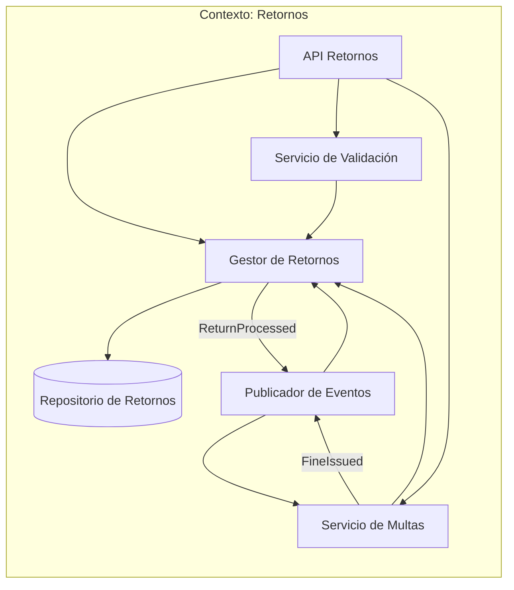
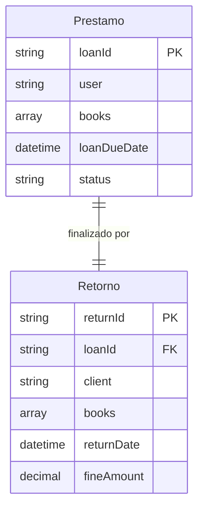
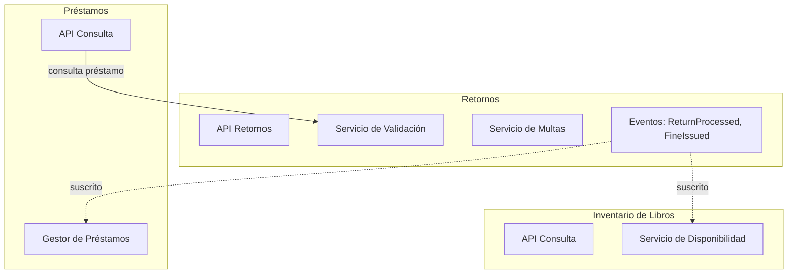

# Contexto delimitado: Retornos

## Tabla de contenidos

- [Descripción](#descripción)
- [Responsabilidades](#responsabilidades)
  - [Lenguaje ubicuo](#lenguaje-ubicuo)
- [Modelo del dominio](#modelo-del-dominio)
  - [Entidad principal: Retorno](#entidad-principal-retorno)
  - [Lo que el contexto no sabe](#lo-que-el-contexto-no-sabe)
- [Eventos](#eventos)
  - [Eventos emitidos](#eventos-emitidos-publicados-por-este-contexto)
  - [Eventos consumidos](#eventos-consumidos)
- [Diagramas](#diagramas)
  - [Comunicación interna del contexto](#comunicación-interna-del-contexto)
  - [Relación entre Retorno y Préstamo](#relación-entre-retorno-y-préstamo)
  - [Comunicación con otros contextos](#comunicación-con-otros-contextos)
- [Resumen](#resumen)

## Descripción

El contexto de Retornos se encarga de gestionar el proceso de devolución de libros prestados en la biblioteca. En este contexto, los retornos son registros de devoluciones exitosas; la existencia de un registro en la base de datos indica que el proceso se completó correctamente, mientras que la ausencia indica que no se realizó o falló. Este contexto valida que el retorno sea válido consultando la información del préstamo y calcula multas cuando corresponda.

## Responsabilidades

- Gestionar el proceso de retorno de libros prestados
- Validar que los retornos correspondan a préstamos activos
- Calcular y generar multas por retrasos en las devoluciones

### Lenguaje ubicuo

| Término           | Significado en este contexto                          |
| ----------------- | ----------------------------------------------------- |
| **Retorno**       | Proceso de devolución de libros prestados             |
| **Multa**         | Sanción monetaria por retraso en la devolución       |
| **Validación**    | Verificación de que el retorno corresponde a un préstamo válido |
| **Finalización**  | Actualización del préstamo como completado            |

## Modelo del dominio

### Entidad principal: Retorno

Un **Retorno** representa el registro de la devolución exitosa de libros asociados a un préstamo específico. La existencia de un registro en la base de datos indica que el retorno fue procesado correctamente; la ausencia de registro indica que no se realizó o falló.

```
Retorno {
    returnId,
    loanId,      // FK to Préstamo.loanId
    client,
    books,
    returnDate,
    fineAmount   // 0 si no hay multa
}
```

### Lo que el contexto no sabe

- Detalles específicos de los libros (solo IDs)
- Información del inventario de libros
- Estados de disponibilidad de libros
- Información de usuarios más allá del cliente del préstamo

## Eventos

### Eventos emitidos (publicados por este contexto)

| Evento                  | Descripción                                          | Consumidores típicos                     |
| ----------------------- | ---------------------------------------------------- | ---------------------------------------- |
| `ReturnProcessed`       | El retorno ha sido procesado exitosamente            | Inventario, Préstamos                    |
| `FineIssued`            | Se ha generado una multa por retraso                 | Notificaciones                           |

### Eventos consumidos

Este contexto no consume eventos externos directamente, sino que se activa mediante consultas de usuarios.

## Diagramas

### Comunicación interna del contexto



**Notas sobre la arquitectura interna:**
- **Gestor de Retornos**: Coordina el proceso completo de retorno
- **Servicio de Validación**: Consulta la API de Préstamos para validar que el retorno corresponde a un préstamo activo
- **Servicio de Multas**: Calcula multas por retrasos y las registra
- **Repositorio de Retornos**: Almacena información de los retornos procesados
- **API Retornos**: Entry point para solicitudes de retorno
- **Publicador de Eventos**: Emite eventos hacia el bus de eventos


### Relación entre Retorno y Préstamo



### Comunicación con otros contextos



**Notas sobre la comunicación:**
- **Retornos → Préstamos**: Consulta API para validar préstamos activos
- **Retornos → Inventario**: Emite `ReturnProcessed` para actualizar disponibilidad
- **Retornos → Préstamos**: Emite `ReturnProcessed` para finalizar préstamos
- **Retornos → Notificaciones**: Emite `FineIssued` para informar multas

## Resumen

| Aspecto             | Detalle                                                                   |
| ------------------- | ------------------------------------------------------------------------- |
| **Responsabilidad** | Gestionar los retornos de libros y calcular multas                        |
| **Retorno**         | Registro de devolución exitosa; existencia indica éxito, ausencia indica fallo |
| **Comunicación**    | Consulta API de Préstamos; emite eventos para Inventario y Notificaciones |
| **Independencia**   | Depende de Préstamos para validación, actualiza Inventario vía eventos    |
