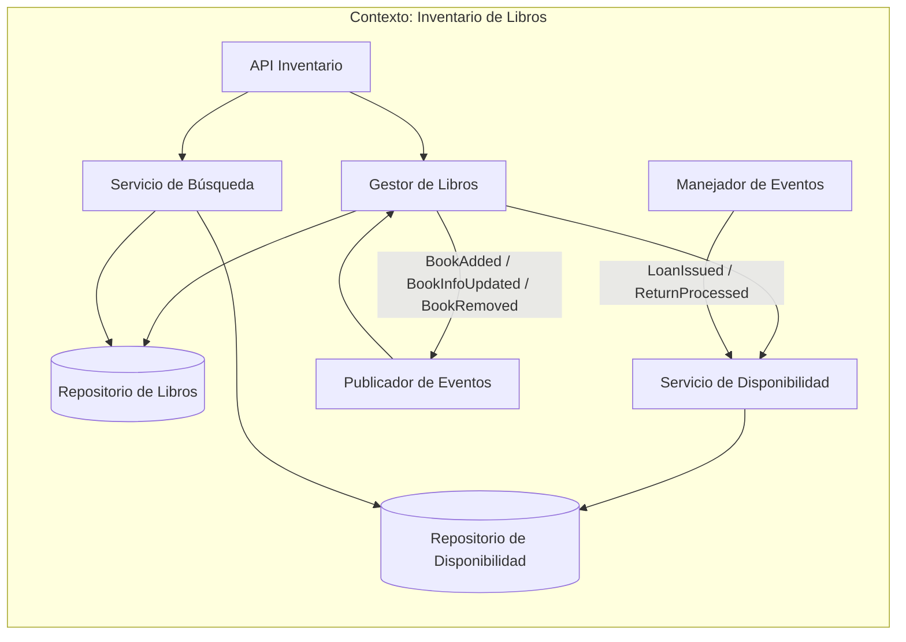
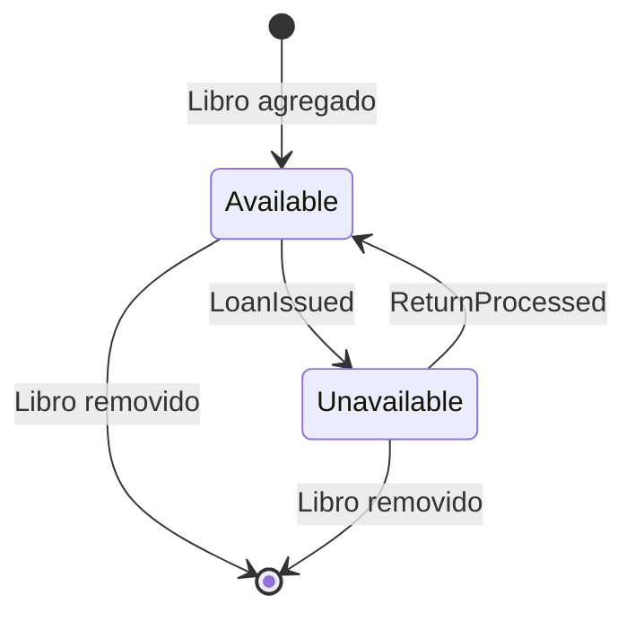
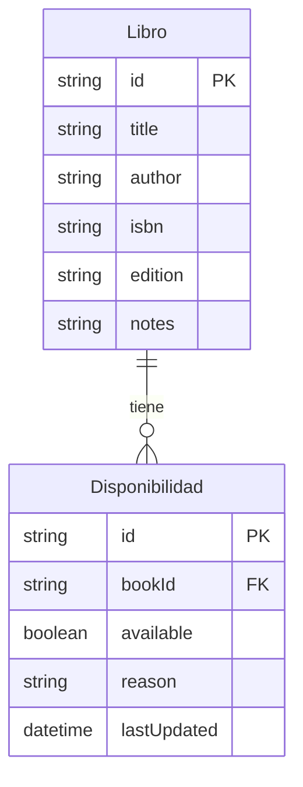
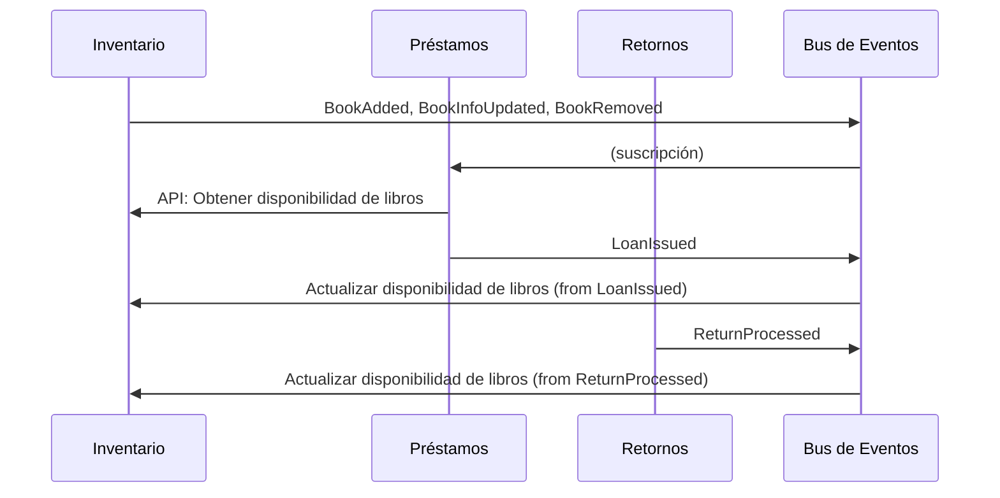
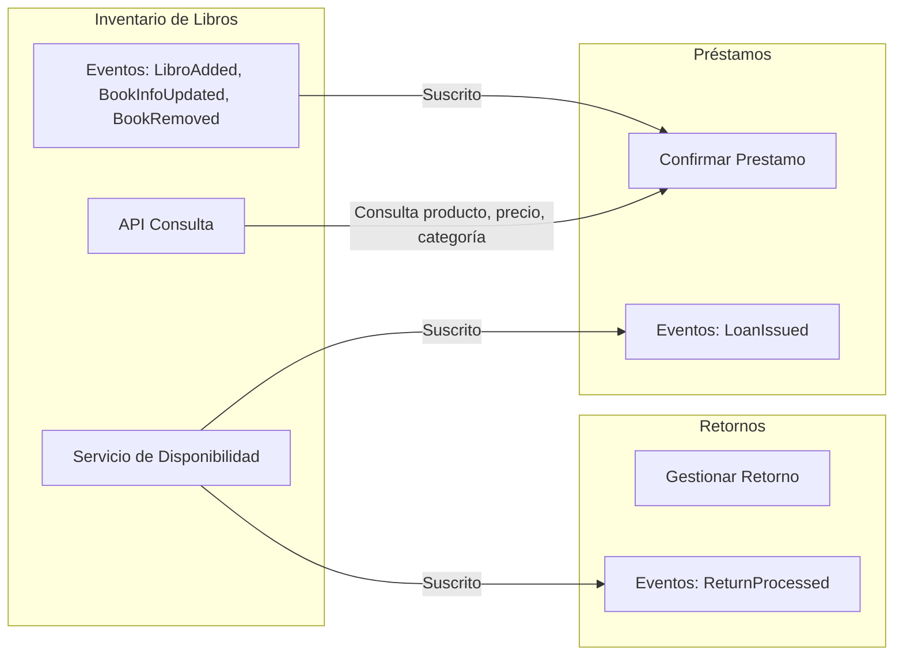

# Contexto delimitado: Inventario de libros

## Tabla de contenidos

- [Descripción](#descripción)
- [Responsabilidades](#responsabilidades)
  - [Lenguaje ubicuo](#lenguaje-ubicuo)
- [Modelo del dominio](#modelo-del-dominio)
  - [Entidad principal: Libro](#entidad-principal-libro)
  - [Entidad: Disponibilidad](#entidad-disponibilidad)
  - [Lo que el contexto no sabe](#lo-que-el-contexto-no-sabe)
- [Eventos](#eventos)
  - [Eventos emitidos](#eventos-emitidos-publicados-por-este-contexto)
  - [Eventos consumidos](#eventos-consumidos)
- [Diagramas](#diagramas)
  - [Comunicación interna del contexto](#comunicación-interna-del-contexto)
  - [Ciclo de estados de disponibilidad](#ciclo-de-estados-de-disponibilidad)
  - [Relación entre Libro y Disponibilidad](#relación-entre-libro-y-disponibilidad)
  - [Comunicación con otros contextos](#comunicación-con-otros-contextos)
- [Resumen](#resumen)


## Descripción

El inventario de libros maneja cuáles libros existen en la biblioteca. Define sus características o atributos y principalmente, les asigna un atributo que define si están disponibles para préstamos o no. Bajo este contexto, si el inventario define que un libro no está disponible, significa que el libro sigue siendo propiedad de la biblioteca y el libro físico existe pero no puede ser prestado. Algunas razones pueden ser el alto valor del libro, única copia en la biblioteca, en estado de préstamo, en restauración, etc. El contexto no sabe de usuarios de la biblioteca, no tiene visibilidad de préstamos pendientes ni retornos en proceso.

## Responsabilidades

- Definición y atributos de los libros (id, título, autor, isbn, edición, disponibilidad)
- Mantener el inventario de la totalidad de libros propiedad de la biblioteca.

### Lenguaje ubicuo

| Término           | Significado en este contexto                          |
| ----------------- | ----------------------------------------------------- |
| **Libro**         | Copia física de algún libro en la biblioteca          |
| **Disponibilidad**| Status de una copia. Si puede ser prestada o no       |
| **Búsqueda**      | Consulta sobre el inventario                          |

## Modelo del dominio

### Entidad principal: Libro

Un **Libro** es una copia física de un libro con cierto ISBN, edición, título, autor, etc.

```
Libro {
    id,
    title,
    author,
    isbn,
    edition,
    notes
}
```

### Entidad: Disponibilidad

La **Disponibilidad** representa el estado actual de préstamo de un libro específico.

```
Disponibilidad {
    id,
    bookId,  // FK to Libro.id
    available,   // True, False
    reason,    // LOANED, RESTORATION, HIGH_VALUE, etc.
    lastUpdated
}
```

### Lo que el contexto no sabe

- Usuarios con intención de préstamo.
- Usuarios con préstamos activos.
- Retornos procesados.
- Multas creadas y enviadas a usuarios.

## Eventos

### Eventos emitidos (publicados por este contexto)

| Evento                  | Descripción                                          | Consumidores típicos                     |
| ----------------------- | ---------------------------------------------------- | ---------------------------------------- |
| `BookAdded`             | Un nuevo libro está disponible en el inventario      | Préstamos (para mostrar al usuario)     |
| `BookInfoUpdated`       | Cambios en título, autor, ISBN, edición o disponibilidad | Préstamos (solo referencia)         |
| `BookRemoved`           | El libro es removido del inventario                  | Préstamos (evitar préstamos de libros removidos) |

### Eventos consumidos

| Evento           | Descripción                                          | Origen (contexto emisor)                 |
| ---------------- | ---------------------------------------------------- | ---------------------------------------- |
| `LoanIssued`     | Un libro ha sido prestado, dejando de estar disponible | Préstamos                                |
| `ReturnProcessed`| Un libro ha sido devuelto y vuelve a estar disponible | Retornos                                 |


## Diagramas

### Comunicación interna del contexto



**Notas sobre la arquitectura interna:**
- **Gestor de Libros**: Coordina la gestión de libros, incluyendo agregar, actualizar y remover libros del inventario
- **Repositorio de Libros**: Almacena la información detallada de los libros (título, autor, ISBN, etc.)
- **Manejador de Eventos**: Procesa eventos externos como `LoanIssued` y `ReturnProcessed` para actualizar la disponibilidad
- **Servicio de Disponibilidad**: Gestiona el estado de disponibilidad de los libros y actualiza el repositorio correspondiente
- **Repositorio de Disponibilidad**: Almacena el estado de disponibilidad de cada libro
- **Servicio de Búsqueda**: Permite consultar libros y su disponibilidad a través de la API
- **API Inventario**: Punto de entrada para consultas externas sobre libros y disponibilidad
- **Publicador de Eventos**: Emite eventos como `BookAdded`, `BookInfoUpdated` y `BookRemoved` hacia el bus de eventos

## Ciclo de estados de disponibilidad



## Relación entre Libro y Disponibilidad




## Comunicación con otros contextos



Los otros dos contextos, Retornos y Préstamos son los que emiten los eventos que actualizan la disponibilidad de un libro.



## Resumen

| Aspecto             | Detalle                                                                   |
| ------------------- | ------------------------------------------------------------------------- |
| **Responsabilidad** | Gestionar el inventario de libros y sus especificaciones y disponibilidad |
| **Libro**           | Copia física de un libro                                                  |
| **Comunicación**    | Emite eventos de cambios de información de los libros; expone API de consulta para Préstamos |
| **Independencia**   | La disponibilidad depende de los contextos retornos y préstamos           |      

