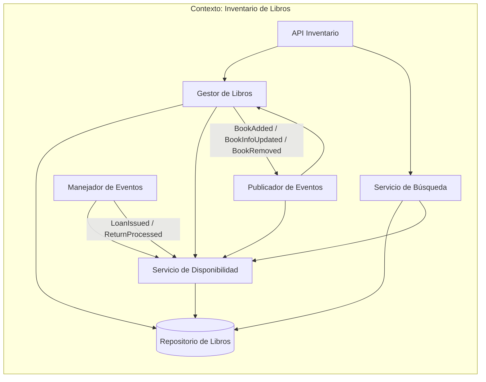

# Contexto delimitado: Inventario de libros

## Tabla de contenidos


## Descripción

El inventario de libros maneja cuáles libros existen en la biblioteca. Define sus características o atributos y principalmente, les asigna un atributo que define si están disponibles para préstamos o no. Bajo este contexto, si el inventario define que un libro no está disponible, significa que el libro sigue siendo propiedad de la biblioteca y el libro físico existe pero no puede ser prestado. Algunas razones pueden ser el alto valor del libro, única copia en la biblioteca, en estado de préstamo, en restauración, etc. El contexto no sabe de usuarios de la biblioteca, no tiene visibilidad de préstamos pendientes ni retornos en proceso.

## Responsabilidades

- Definición y atributos de los libros (id, título, autor, isbn, edición, disponibilidad)
- Mantener el inventario de la totalidad de libros propiedad de la biblioteca.

### Lenguaje ubicuo

| Término           | Significado en este contexto                          |
| ----------------- | ----------------------------------------------------- |
| **Libro**         | Copia física de algún libro en la biblioteca          |
| **Disponibilidad**| Status de una copia. Si puede ser prestada o no       |
| **Búsqueda**      | Consulta sobre el inventario                          |

## Modelo del dominio

### Entidad principal: Libro

Un **Libro** es una copia física de un libro con cierto ISBN, edición, título, autor, etc que puede estar o no disponible para préstamos.

```
Libro {
    id,
    titulo,
    autor,
    isbn,
    edicion,
    disponibilidad,
    notas
}
```

### Lo que el contexto no sabe

- Usuarios con intención de préstamo.
- Usuarios con préstamos activos.
- Retornos procesados.
- Multas creadas y enviadas a usuarios.

## Eventos

### Eventos emitidos (publicados por este contexto)

| Evento                  | Descripción                                          | Consumidores típicos                     |
| ----------------------- | ---------------------------------------------------- | ---------------------------------------- |
| `BookAdded`             | Un nuevo libro está disponible en el inventario      | Préstamos (para mostrar al usuario)     |
| `BookInfoUpdated`       | Cambios en título, autor, ISBN, edición o disponibilidad | Préstamos (solo referencia)         |
| `BookRemoved`           | El libro es removido del inventario                  | Préstamos (evitar préstamos de libros removidos) |

### Eventos consumidos

| Evento           | Descripción                                          | Origen (contexto emisor)                 |
| ---------------- | ---------------------------------------------------- | ---------------------------------------- |
| `LoanIssued`     | Un libro ha sido prestado, dejando de estar disponible | Préstamos                                |
| `ReturnProcessed`| Un libro ha sido devuelto y vuelve a estar disponible | Retornos                                 |


## Diagramas

### Comunicación interna del contexto



