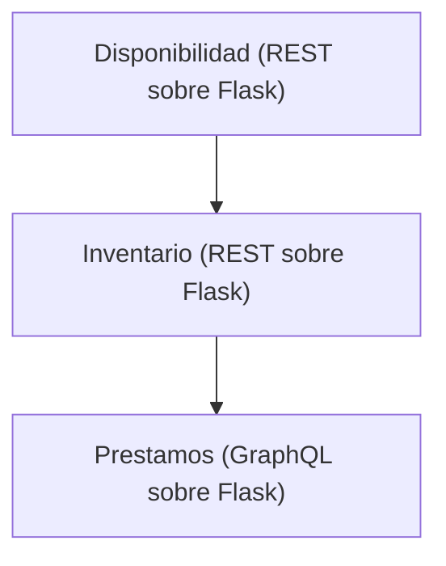

# Tarea 2

## Servicios dentro de una biblioteca



- URL del servicio de Disponibilidad: http://localhost:5000/apidocs
- URL del servicio de Inventario: http://localhost:5001/apidocs
- URL del servicio de Prestamos: http://localhost:5002/graphql


## Ejemplo de ruta que utiliza los 3 servicios:

1. En http://localhost:5001/apidocs, utilice la ruta books/ para obtener todos los libros, localice el `bookId` de tres libros, donde dos de ellos tengan el atributo `"available": true` y uno tenga `"available": false`. Ejemplo:

```
  {
    "author": "Vanessa Bryan",
    "available": true,
    "bookId": 3,
    "edition": 3,
    "isbn": "978-1-57995-706-3",
    "notes": "Activity administration force lot election very.",
    "title": "Along explain try pattern."
  },
  {
    "author": "Emily Bryan",
    "available": true,
    "bookId": 4,
    "edition": 1,
    "isbn": "978-0-595-39411-1",
    "notes": "Television message activity him.",
    "title": "Evidence dog."
  },
  {
    "author": "Kelsey Russell",
    "available": false,
    "bookId": 5,
    "edition": 3,
    "isbn": "978-0-348-00339-0",
    "notes": "Walk record assume make.",
    "title": "Early perhaps."
  },
```

2. En http://localhost:5002/graphql, utilice la siguiente mutación. Reemplace `books: ["BOOKID-HERE", "BOOKID-HERE"]` con los bookIds de un libro disponible y un libro no disponible. El request va a fallar

```graphql
mutation {
  addPrestamo(input: {
    user: "Juan Pérez"
    books: ["BOOKID-HERE", "BOOKID-HERE"]
    loanDueDate: "2026-05-10"
  }) {
    loanId
    user
    books
    loanDueDate
    status
  }
}
```

3. Observe el request fallar con:

```json
{
  "data": null,
  "errors": [
    {
      "message": "Libro con id 999 no disponible para préstamo",
      "path": ["addPrestamo"]
    }
  ]
}
```

4. Reemplace un bookId del libro no disponible por el bookId de un libro disponible. Realice el request nuevamente. Observe el préstamo creado.

```json
{
  "data": {
    "addPrestamo": {
      "loanId": 7,
      "user": "Juan Pérez",
      "books": [
        "3",
        "9"
      ],
      "loanDueDate": "2026-05-10",
      "status": "ACTIVE"
    }
  }
}
```
### Explicación

Cuando el servicio de **Préstamos** crea un nuevo préstamo, primero consulta al servicio de **Inventario** para verificar que los libros solicitados existen. Luego, para cada libro solicitado, consulta al servicio de **Disponibilidad** para verificar que el libro está disponible para préstamo. Si alguno de los libros no está disponible, el servicio de Préstamos devuelve un error indicando qué libro no se puede prestar. Si todos los libros están disponibles, el servicio de Préstamos procede a crear el préstamo y retorna los detalles del mismo.