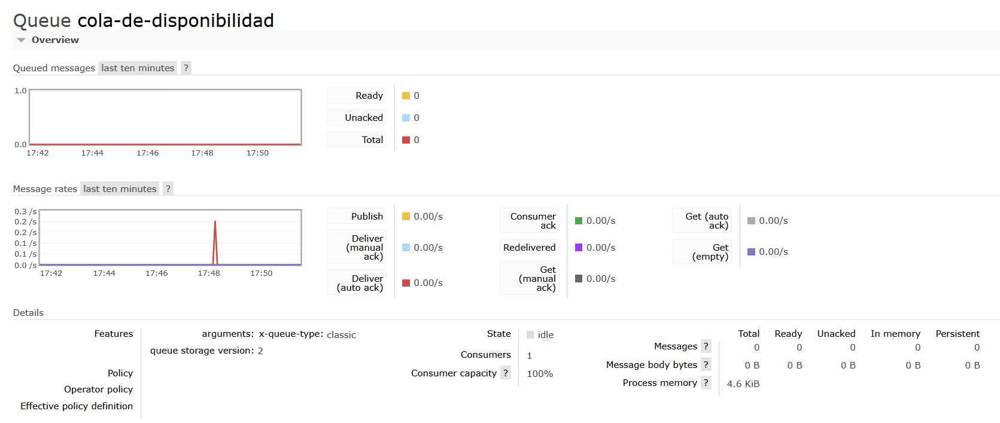
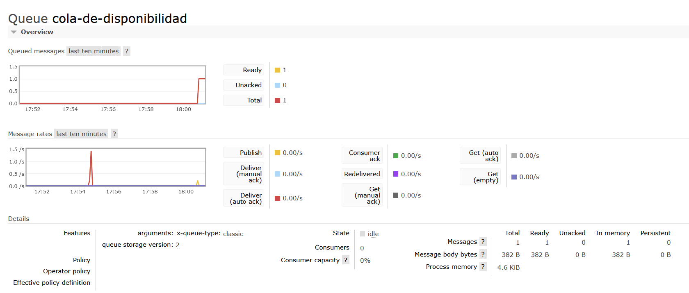
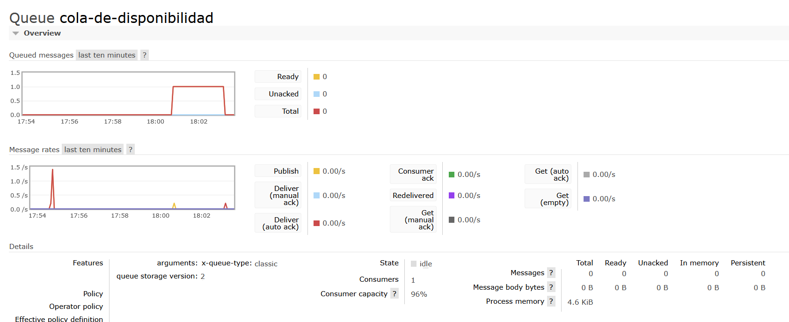
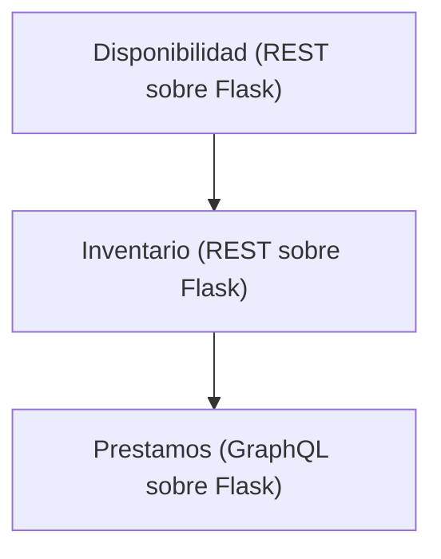

# Tarea 3

## Mensajería Asíncrona con RabbitMQ
En esta tarea  se implemetó mensajería asíncrona utilizando RabbitMQ para comunicar los servicios de Disponibilidad y Inventario. El servicio de Disponibilidad envía mensajes a una cola de RabbitMQ. El servicio de Inventario consume dichos mensajes; por el momento, el servicio de Inventario solo imprime el mensaje recibido, pero en una implementación real podría actualizar su base de datos o realizar otras acciones basadas en la información recibida.

### Pasos para ejecutar la tarea

1. Dentro de  `SOA-I-2026/tarea3/` ejecute el siguiente comando para iniciar los servicios y RabbitMQ utilizando Docker Compose:

```bash
~/SOA-I-2026/tarea3$ docker compose up --build
```

2. Espere a que los servicios se inicien completamente. Debería ver mensajes en la terminal indicando que los servicios están corriendo y que RabbitMQ está listo para recibir mensajes.

3. En `http://localhost:5000/apidocs/` se encuentra el servicio de Disponibilidad. Utilice la ruta `GET /disponibilidad/rabbitmq` para enviar un mensaje con las disponibilidades a RabbitMQ. Una vez enviado el mensaje, revise la terminal donde se están ejecutando los servicios. Debería ver dos mensajes: uno indicando que el servicio de Disponibilidad ha enviado un mensaje a RabbitMQ, y otro indicando que el servicio de Inventario ha recibido el mensaje.

Disponibilidad envía el siguiente mensaje a RabbitMQ:

```bash
disponibilidad  | 2026-05-15 23:48:11,901 - INFO - Disponibilidad enviada a RabbitMQ: {'disponibilidades': [{'disponibilidadId': 5, 'bookId': 1, 'available': True, 'reason': None, 'lastUpdated': '2026-05-15T23:39:49.322287'}, {'disponibilidadId': 6, 'bookId': 3, 'available': True, 'reason': None, 'lastUpdated': '2026-05-15T23:39:49.322333'}, {'disponibilidadId': 3, 'bookId': 4, 'available': False, 'reason': 'ON LOAN', 'lastUpdated': '2026-05-15T23:39:49.322338'}]}
```

Inventario recibe el siguiente mensaje de RabbitMQ:

```bash
inventario      | 2026-05-15 23:48:11,903 - INFO - Mensaje recibido de RabbitMQ: {'disponibilidades': [{'disponibilidadId': 5, 'bookId': 1, 'available': True, 'reason': None, 'lastUpdated': '2026-05-15T23:39:49.322287'}, {'disponibilidadId': 6, 'bookId': 3, 'available': True, 'reason': None, 'lastUpdated': '2026-05-15T23:39:49.322333'}, {'disponibilidadId': 3, 'bookId': 4, 'available': False, 'reason': 'ON LOAN', 'lastUpdated': '2026-05-15T23:39:49.322338'}]}
```

4. En `http://localhost:15672` puede acceder a la interfaz de administración de RabbitMQ. Inicie sesión con el usuario `guest` y la contraseña `guest`. En la pestaña "Queues", debería ver una cola llamada `cola-de-disponibilidad`. Haga clic en esa cola para ver los mensajes que han sido enviados. Debería ver el mensaje que envió el servicio de Disponibilidad y un consumidor. El gráfico de Queued Messages estará vacía porque el servicio de Inventario ya ha consumido el mensaje.



5. Para ver mensajes en cola, abra una segunda terminal y ejecute el siguiente comando para detener el servicio de Inventario:

```bash
~/SOA-I-2026/tarea3$ docker compose stop inventario
[+] stop 1/1
 ✔ Container inventario Stopped 
```
En la terminal donde se están ejecutando los servicios, debería ver que el servicio de Inventario se ha detenido.

```bash
inventario      | [2026-05-15 23:57:20 +0000] [1] [INFO] Shutting down: Master
inventario exited with code 0
```

6. Ahora, si envía nuevamente un mensaje desde el servicio de Disponibilidad, el mensaje se quedará en la cola de RabbitMQ porque no hay ningún consumidor (el servicio de Inventario) para consumirlo. En la interfaz de administración de RabbitMQ, debería ver que el mensaje enviado se encuentra en la cola `cola-de-disponibilidad` y que el gráfico de Queued Messages muestra 1 mensaje en cola y cero consumidores.



7. Inicie nuevamente el servicio de Inventario con el siguiente comando:

```bash
~/SOA-I-2026/tarea3$ docker compose start inventario
[+] Starting 1/1
 ✔ Container inventario Started
```

El servicio de Inventario se iniciará y consumirá el mensaje que estaba en la cola. En la interfaz de administración de RabbitMQ, debería ver que el mensaje ha sido consumido y que el gráfico de Queued Messages vuelve a estar en cero.



8. Ejecute el siguiente comando para observar los logs del servicio de Inventario. Debería ver el mensaje que fue consumido de RabbitMQ.

```bash
~/SOA-I-2026/tarea3$ docker logs inventario
2026-05-16 00:03:07,724 - INFO - Created channel=1
2026-05-16 00:03:07,729 - INFO - Esperando mensajes de RabbitMQ...
2026-05-16 00:03:07,729 - INFO - Mensaje recibido de RabbitMQ: {'disponibilidades': [{'disponibilidadId': 5, 'bookId': 1, 'available': True, 'reason': None, 'lastUpdated': '2026-05-15T23:39:49.322287'}, {'disponibilidadId': 6, 'bookId': 3, 'available': True, 'reason': None, 'lastUpdated': '2026-05-15T23:39:49.322333'}, {'disponibilidadId': 3, 'bookId': 4, 'available': False, 'reason': 'ON LOAN', 'lastUpdated': '2026-05-15T23:39:49.322338'}]}
```

9. Para detener los servicios y RabbitMQ, ejecute el siguiente comando:

```bash
rigel@rigel:~/SOA-I-2026/tarea3$ docker compose down
[+] down 5/5
 ✔ Container prestamos Removed                                                                               1.6s
 ✔ Container disponibilidad Removed                                                                          1.4s
 ✔ Container inventario     Removed                                                                          0.9s
 ✔ Container rabbitmq       Removed                                                                          1.8s
 ✔ Network tarea3_default   Removed 
```

# Tarea 2

## Servicios dentro de una biblioteca



- URL del servicio de Disponibilidad: http://localhost:5000/apidocs
- URL del servicio de Inventario: http://localhost:5001/apidocs
- URL del servicio de Prestamos: http://localhost:5002/graphql


## Ejemplo de ruta que utiliza los 3 servicios:

1. En http://localhost:5001/apidocs, utilice la ruta books/ para obtener todos los libros, localice el `bookId` de tres libros, donde dos de ellos tengan el atributo `"available": true` y uno tenga `"available": false`. Ejemplo:

```
  {
    "author": "Vanessa Bryan",
    "available": true,
    "bookId": 3,
    "edition": 3,
    "isbn": "978-1-57995-706-3",
    "notes": "Activity administration force lot election very.",
    "title": "Along explain try pattern."
  },
  {
    "author": "Emily Bryan",
    "available": true,
    "bookId": 4,
    "edition": 1,
    "isbn": "978-0-595-39411-1",
    "notes": "Television message activity him.",
    "title": "Evidence dog."
  },
  {
    "author": "Kelsey Russell",
    "available": false,
    "bookId": 5,
    "edition": 3,
    "isbn": "978-0-348-00339-0",
    "notes": "Walk record assume make.",
    "title": "Early perhaps."
  },
```

2. En http://localhost:5002/graphql, utilice la siguiente mutación. Reemplace `books: ["BOOKID-HERE", "BOOKID-HERE"]` con los bookIds de un libro disponible y un libro no disponible. El request va a fallar

```graphql
mutation {
  addPrestamo(input: {
    user: "Juan Pérez"
    books: ["BOOKID-HERE", "BOOKID-HERE"]
    loanDueDate: "2026-05-10"
  }) {
    loanId
    user
    books
    loanDueDate
    status
  }
}
```

3. Observe el request fallar con:

```json
{
  "data": null,
  "errors": [
    {
      "message": "Libro con id 999 no disponible para préstamo",
      "path": ["addPrestamo"]
    }
  ]
}
```

4. Reemplace un bookId del libro no disponible por el bookId de un libro disponible. Realice el request nuevamente. Observe el préstamo creado.

```json
{
  "data": {
    "addPrestamo": {
      "loanId": 7,
      "user": "Juan Pérez",
      "books": [
        "3",
        "9"
      ],
      "loanDueDate": "2026-05-10",
      "status": "ACTIVE"
    }
  }
}
```
### Explicación

Cuando el servicio de **Préstamos** crea un nuevo préstamo, primero consulta al servicio de **Inventario** para verificar que los libros solicitados existen. Luego, para cada libro solicitado, consulta al servicio de **Disponibilidad** para verificar que el libro está disponible para préstamo. Si alguno de los libros no está disponible, el servicio de Préstamos devuelve un error indicando qué libro no se puede prestar. Si todos los libros están disponibles, el servicio de Préstamos procede a crear el préstamo y retorna los detalles del mismo.