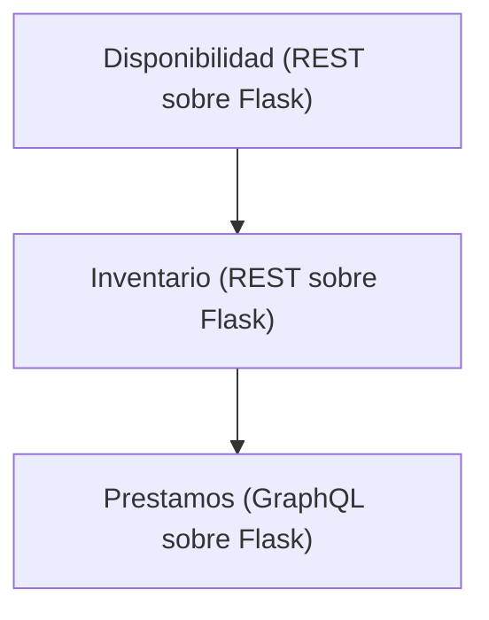

# Tarea 5

## Servicios dentro de una biblioteca



- URL del servicio de Disponibilidad: http://localhost:5000/apidocs
- URL del servicio de Inventario: http://localhost:5001/apidocs
- URL del servicio de Prestamos: http://localhost:5002/graphql


## Ejemplo de ruta que utiliza los 3 servicios con correlation ID:

1. En http://localhost:5001/apidocs, utilice la ruta books/ para obtener todos los libros, localice el `bookId` de tres libros, donde dos de ellos tengan el atributo `"available": true` y uno tenga `"available": false`. Ejemplo:

```
  {
    "author": "Vanessa Bryan",
    "available": true,
    "bookId": 3,
    "edition": 3,
    "isbn": "978-1-57995-706-3",
    "notes": "Activity administration force lot election very.",
    "title": "Along explain try pattern."
  },
  {
    "author": "Emily Bryan",
    "available": true,
    "bookId": 4,
    "edition": 1,
    "isbn": "978-0-595-39411-1",
    "notes": "Television message activity him.",
    "title": "Evidence dog."
  },
  {
    "author": "Kelsey Russell",
    "available": false,
    "bookId": 5,
    "edition": 3,
    "isbn": "978-0-348-00339-0",
    "notes": "Walk record assume make.",
    "title": "Early perhaps."
  },
```

2. En http://localhost:5002/graphql, utilice la siguiente mutación. Reemplace `books: ["BOOKID-HERE", "BOOKID-HERE"]` con los bookIds de dos libro disponibles.

```graphql
mutation {
  addPrestamo(input: {
    user: "Juan Pérez"
    books: ["BOOKID-HERE", "BOOKID-HERE"]
    loanDueDate: "2026-05-10"
  }) {
    loanId
    user
    books
    loanDueDate
    status
  }
}
```

4. Observe el préstamo creado.

```json
{
  "data": {
    "addPrestamo": {
      "loanId": 7,
      "user": "Juan Pérez",
      "books": [
        "3",
        "1"
      ],
      "loanDueDate": "2026-05-10",
      "status": "ACTIVE"
    }
  }
}
```

En la terminal se observarán logs que indican las llamadas entre servicios, incluyendo el Correlation ID que se propaga a través de los servicios a partir del servicio de Prestamos.

Ejemplo:

```
prestamos       | 2026-06-13 04:42:07,679 - INFO - cid-[1353e5a3-e757-47f3-9a1a-484f2fb2bd76] Petición recibida - Correlation ID: 1353e5a3-e757-47f3-9a1a-484f2fb2bd76 (origen: Header Generado)
inventario      | 2026-06-13 04:42:07,688 - INFO - cid-[1353e5a3-e757-47f3-9a1a-484f2fb2bd76] Petición recibida - Correlation ID: 1353e5a3-e757-47f3-9a1a-484f2fb2bd76 (origen: Header Entrante)
inventario      | 2026-06-13 04:42:07,688 - INFO - cid-[1353e5a3-e757-47f3-9a1a-484f2fb2bd76] Llamando al servicio de disponibilidad para obtener libros disponibles
disponibilidad  | 2026-06-13 04:42:07,690 - INFO - cid-[1353e5a3-e757-47f3-9a1a-484f2fb2bd76] Petición recibida - Correlation ID: 1353e5a3-e757-47f3-9a1a-484f2fb2bd76 (origen: Header Entrante)
disponibilidad  | 2026-06-13 04:42:07,690 - INFO - cid-[1353e5a3-e757-47f3-9a1a-484f2fb2bd76] Obteniendo todas las disponibilidades de libros
inventario      | 2026-06-13 04:42:07,691 - INFO - cid-[1353e5a3-e757-47f3-9a1a-484f2fb2bd76] Libros disponibles encontrados: 2
prestamos       | 2026-06-13 04:42:07,692 - INFO - cid-[1353e5a3-e757-47f3-9a1a-484f2fb2bd76] Prestamo con id 2 creado para usuario Juan Pérez
```

### Explicación

Cuando el servicio de **Préstamos** crea un nuevo préstamo, se genera el correlation ID **1353e5a3-e757-47f3-9a1a-484f2fb2bd76** y se incluye en el header de la petición al servicio de **Inventario**. El servicio de Inventario recibe la petición con el correlation ID en el header, lo propaga a su vez al llamar al servicio de **Disponibilidad**, y ambos servicios registran logs con el mismo correlation ID, lo que permite rastrear la cadena completa de llamadas entre servicios para la operación de creación del préstamo.